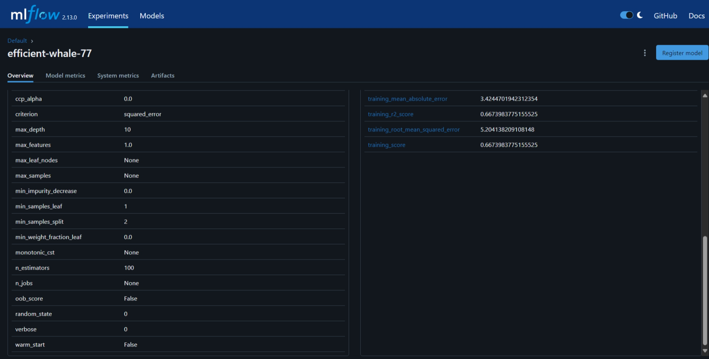
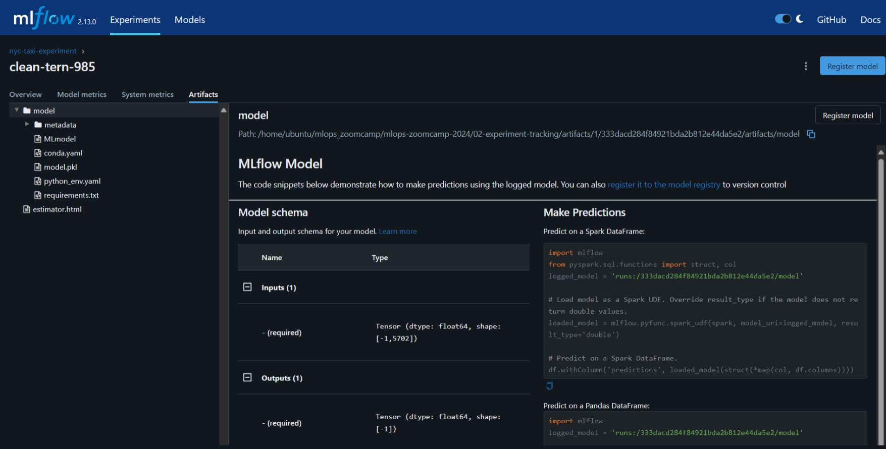
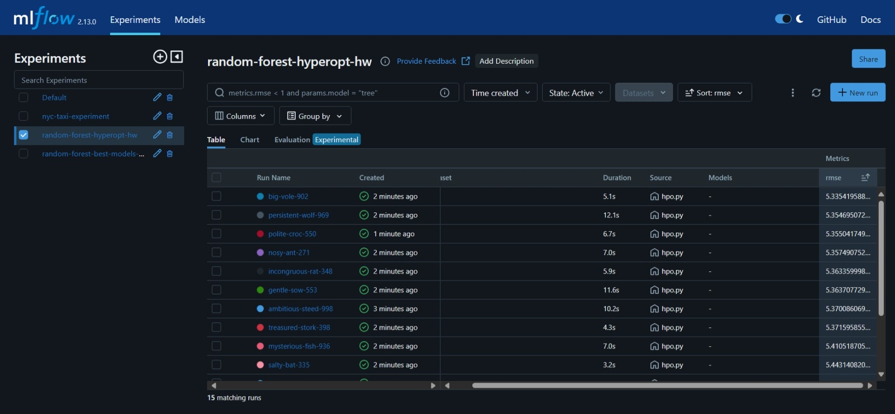
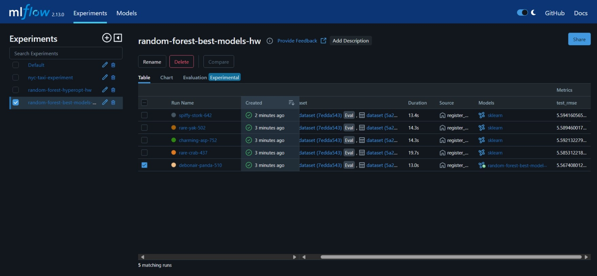

# 02-experiment-tracking

## Homework

- [x]  **Q1. Install MLflow**
    
    ```bash
    docker compose exec mlflow /bin/bash -c "source activate mlflow-env && mlflow --version"
    # mlflow, version 2.13.0
    ```
    or for mlflow installed on your workspace
    ```bash
    mlflow --version
    # mlflow, version 2.13.0
    ```
    
- [x]  **Q2. Download and preprocess the data**
    - [x]  Download the data for January, February and March 2023 in parquet format from [here](https://www1.nyc.gov/site/tlc/about/tlc-trip-record-data.page).
    - [x]  Run `preprocess_data.py`
        
        ```bash
        python preprocess_data.py --raw_data_path ./data --dest_path ./output
        ```
        
    - [x]  How many files were saved to `OUTPUT_FOLDER`?  
    **4**, `dv.pkl`, `train.pkl`, `test.pkl`, and `val.pkl`


- [x]  **Q3. Train a model with autolog**
    - [x]  modify the script to enable **autologging** with MLflow
    - [x]  What is the value of the `min_samples_split` parameter:  
        **2**
        
        
        
- [x]  **Q4. Launch the tracking server locally**
    - [x] To do:
        - launch the tracking server on your local machine,
        - select a SQLite db for the backend store and a folder called `artifacts` for the artifacts store  
        
        ```bash
        mlflow ui --backend-store-uri sqlite:///mlflow.db --default-artifact-root ./artifacts
        ```
    
- [x]  **Q5. Tune model hyperparameters**
    - [x]  Don't use autologging for this exercise.
    - [x]  just log the information that you need to answer the question
        - [x] To do: 
            - The list of hyperparameters that are passed to the `objective` function during the optimization,
            - the RMSE obtained on the validation set (February 2023 data).
    
    
    
    - [x]  What's the best validation RMSE that you got?  
        **5.335**

- [x]  **Q6. Promote the best model to the model registry**
    
    - [x] What is the test RMSE of the best model?  
        **5.567**