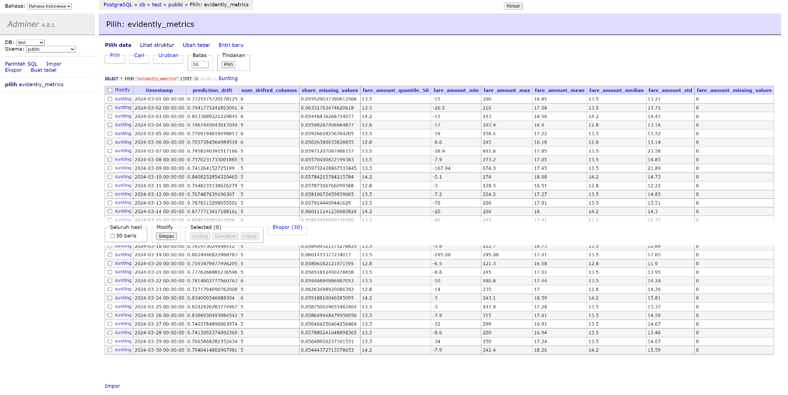
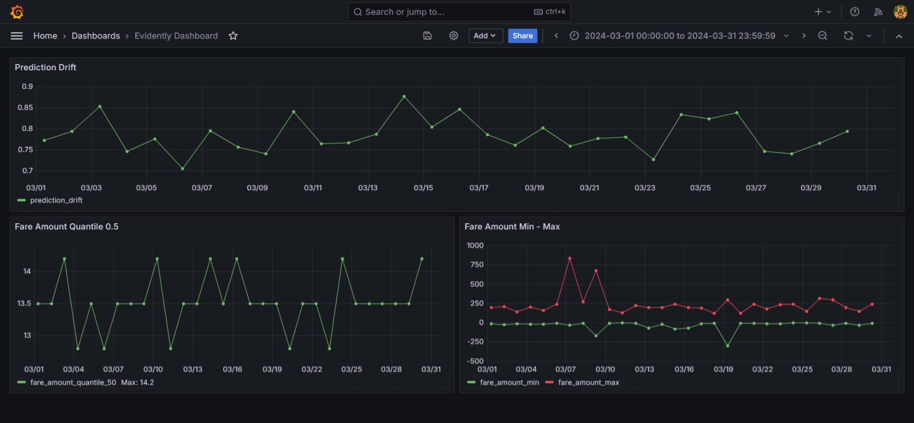

## Homework

The goal of this homework is to familiarize users with monitoring for ML batch services, using **PostgreSQL database** to store metrics and **Grafana** to visualize them.

### Set up Environment

Create new environment

```bash
mamba create -n monitoring python=3.11 -c conda-forge
```

Activate the environment

```bash
mamba activate monitoring
```

Install required packages

Q1. Prepare the dataset

```bash
mamba install -c conda-forge prefect tqdm requests joblib pyarrow psycopg evidently pandas numpy scikit-learn jupyter polars
```

### Scenario

1. Use scikit-learn’s **`HistGradientBoostingClassifier`** as the model to handle missing values in the dataset.
2. Train the model using data from January 2022, maintaining the same portion as in the baseline notebook.
3. Utilize data from March 2024 as the new or current dataset, using the full data without  any filters.

Start with `baseline_model_nyc_taxi_data.ipynb`. Download the March 2024 Green Taxi data. We will use this data to simulate a production usage of a taxi trip duration prediction service.

What is the shape of the downloaded data? How many rows are there?

- 72044
- 78537
- **57457**
- 54396

## Q2. Metric

Let's expand the number of data quality metrics we’d like to monitor! Please add one metric of your choice and a quantile value for the `"fare_amount"` column (`quantile=0.5`).

Hint: explore evidently metric `ColumnQuantileMetric` (from `evidently.metrics import ColumnQuantileMetric`)

What metric did you choose?
`ColumnSummaryMetric`

```python
report = Report(
    metrics=[
        ColumnDriftMetric(column_name='prediction'),
        ColumnQuantileMetric(column_name='fare_amount', quantile=0.5),
        ColumnSummaryMetric(column_name='fare_amount'),
        ColumnMissingValuesMetric(column_name='fare_amount'),
        DatasetDriftMetric(),
        DatasetMissingValuesMetric()
    ]
)
```

## Q3. Monitoring

Let’s start monitoring. Run expanded monitoring for a new batch of data (March 2024).

What is the maximum value of metric `quantile = 0.5` on the `"fare_amount"` column during March 2024 (calculated daily)?

- 10
- 12.5
- **14.2**
- 14.8

```python
prediction_drift = result['metrics'][0]['result']['drift_score']
    num_drifted_columns = result['metrics'][4]['result']['number_of_drifted_columns']
    share_missing_values = result['metrics'][5]['result']['current']['share_of_missing_values']
    fare_amount_quantile_50 = result['metrics'][1]['result']['current']['value']
    fare_amount_min = result['metrics'][2]['result']['current_characteristics']['min']
    fare_amount_max = result['metrics'][2]['result']['current_characteristics']['max']
    fare_amount_mean = result['metrics'][2]['result']['current_characteristics']['mean']
    fare_amount_median = result['metrics'][2]['result']['current_characteristics']['p50']
    fare_amount_std = result['metrics'][2]['result']['current_characteristics']['std']
    fare_amount_missing_values = result['metrics'][3]['result']['current']['number_of_missing_values']
```





## Q4. Dashboard

Finally, let’s add panels with new added metrics to the dashboard. After we customize the  dashboard let's save a dashboard config, so that we can access it later. Hint: click on “Save dashboard” to access JSON configuration of the dashboard. This configuration should be saved locally.

Where to place a dashboard config file?

- `project_folder` (05-monitoring)
- `project_folder/config` (05-monitoring/config)
- **`project_folder/dashboards` (05-monitoring/dashboards)**
- `project_folder/data` (05-monitoring/data)

## Submit the results

- Submit your answers here: https://courses.datatalks.club/mlops-zoomcamp-2024/homework/hw5